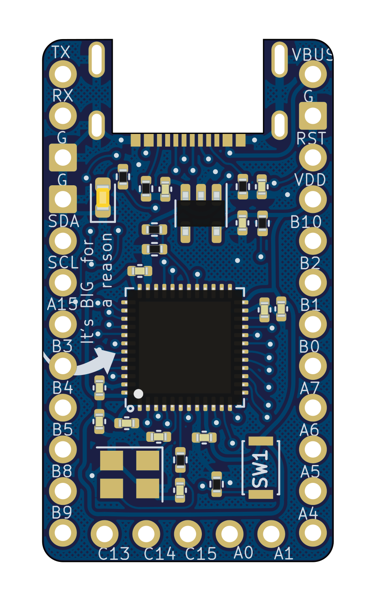
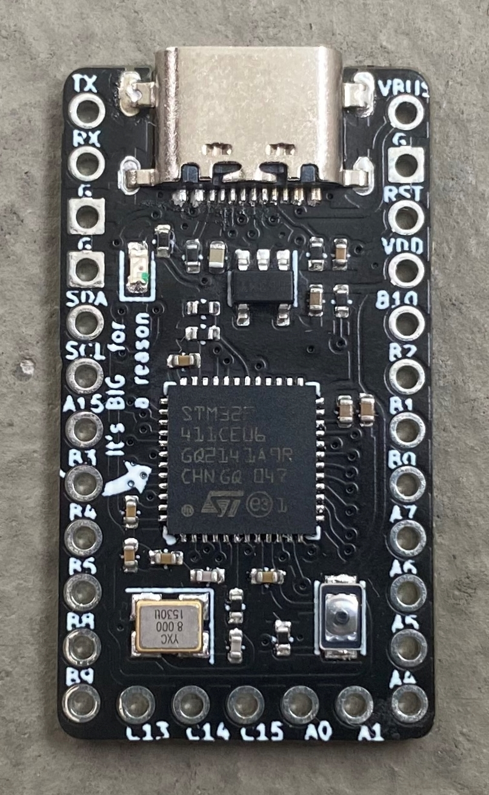
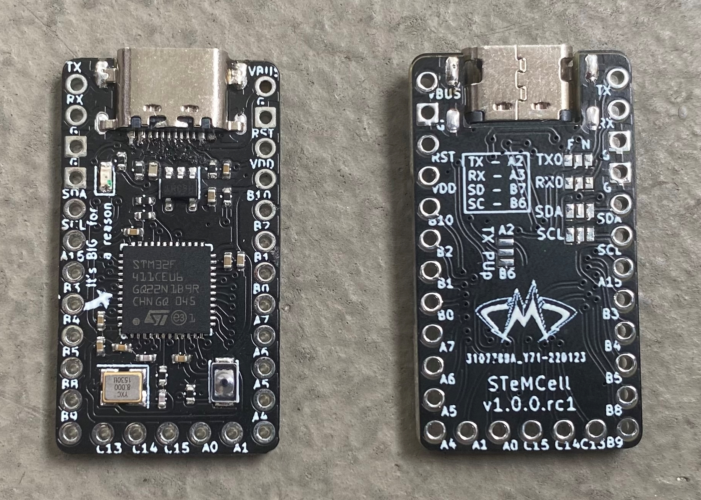
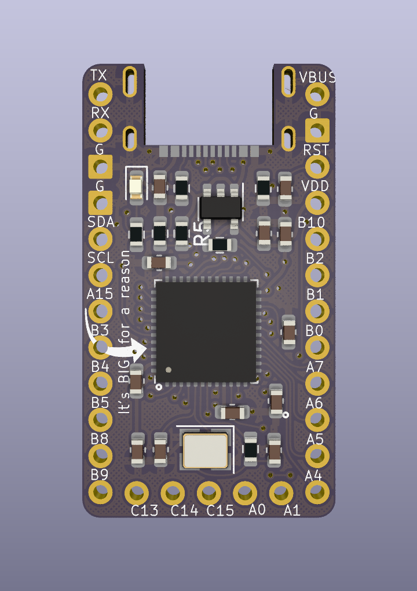
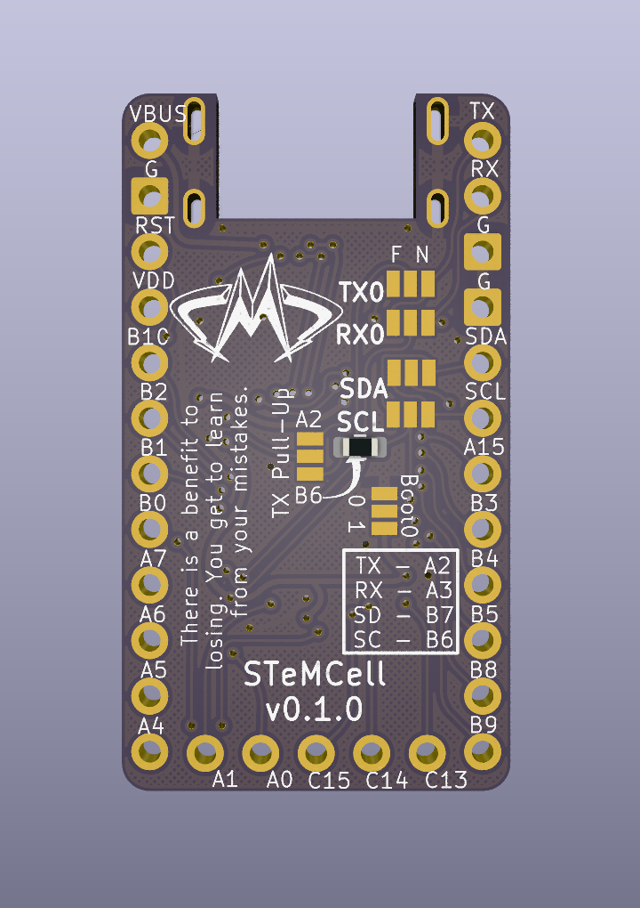
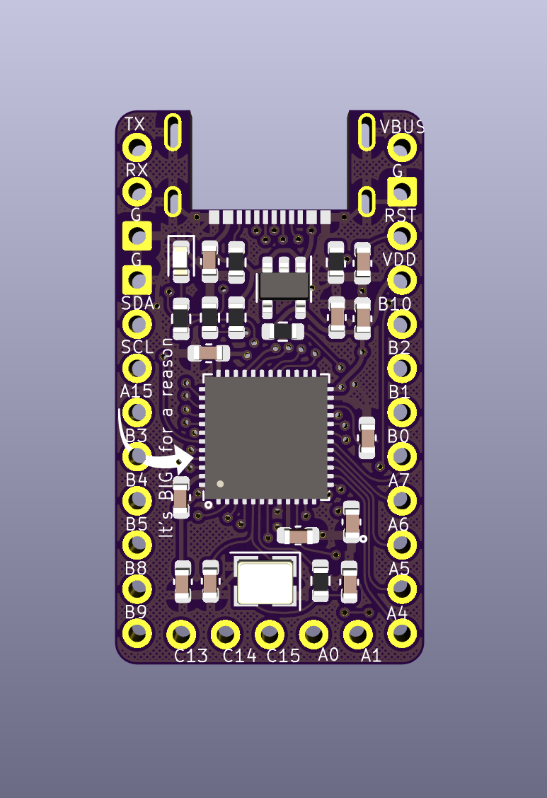
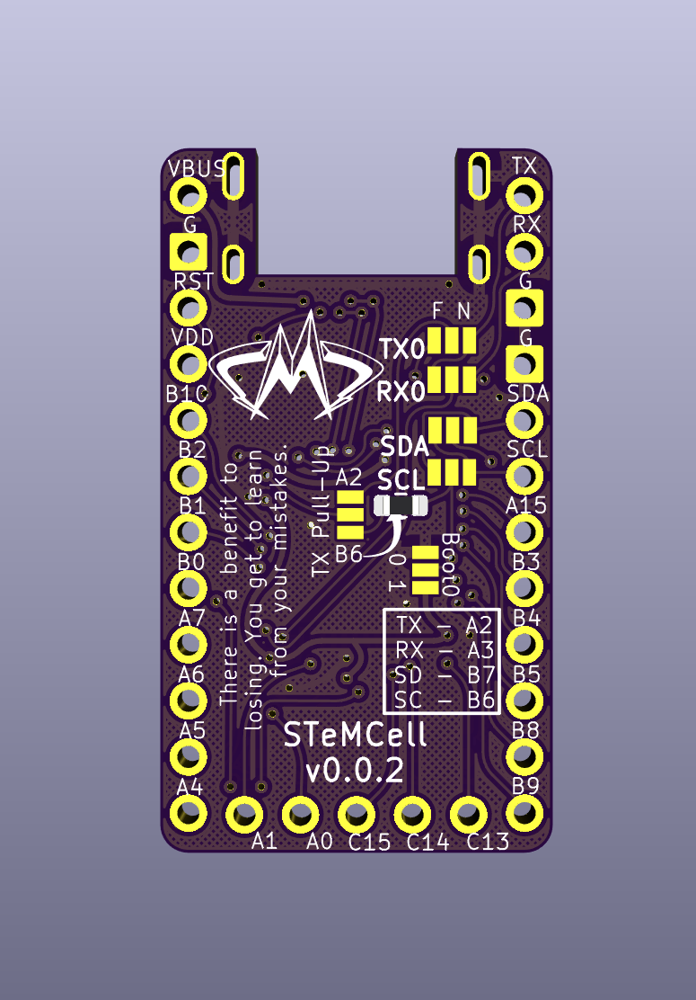
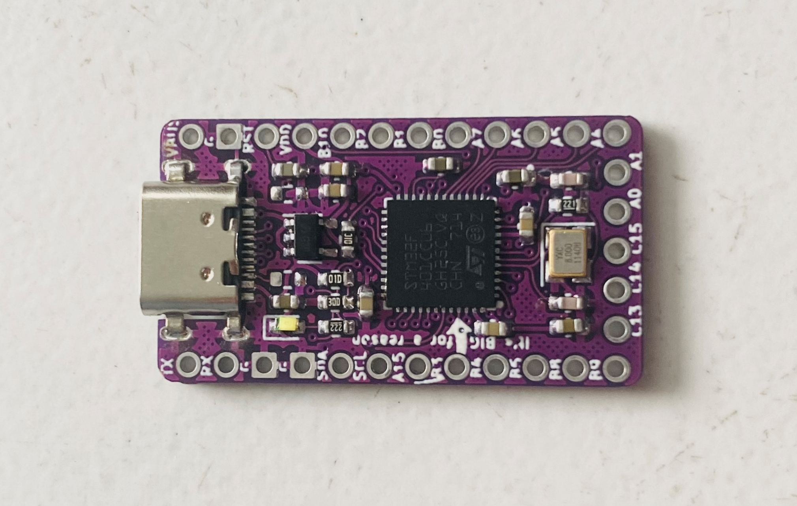
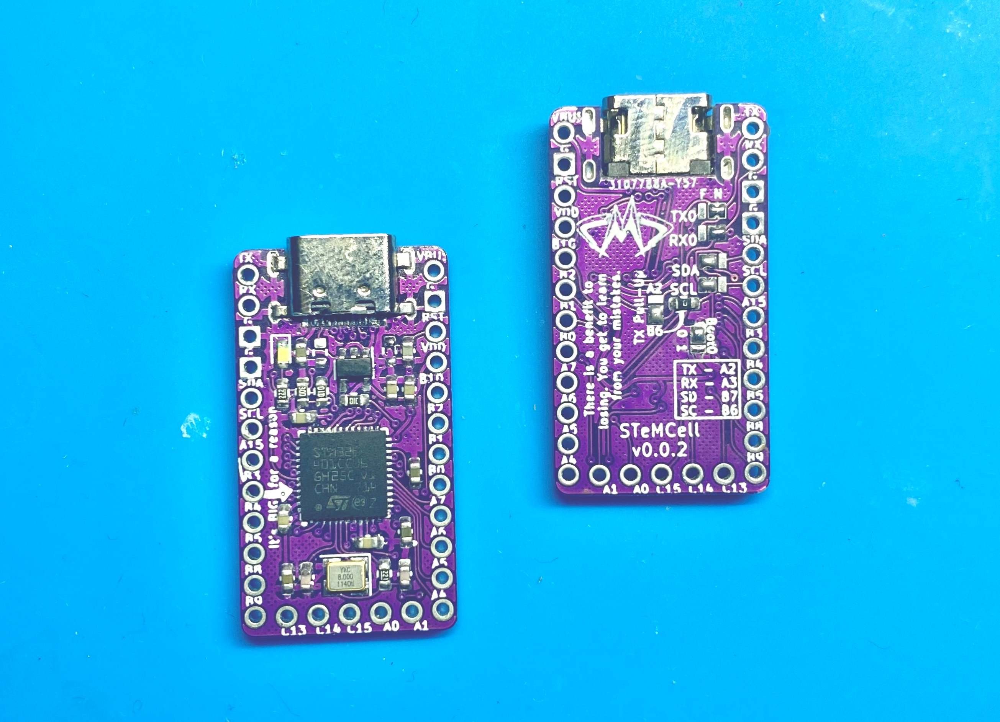
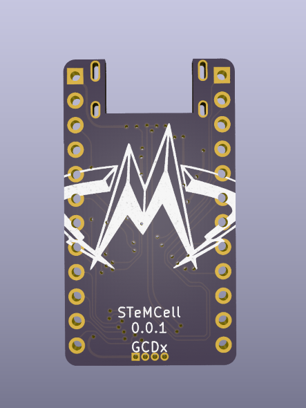

# STeMCell
 STM32 breakout in promicro footprint


## Features:

* Pro micro footprint
* STM32F4x1 series MCU
* Support half duplex USART communication in any of D0, D1, D2, D3 using jumpers
* Onboard switch to enable/disable USB DFU bootloader
* Inbuilt TX pullup for UART half duplex communication
* User LED on PA8
* Extra 5 pinout on bottom like Elite C
* Supports QMK and ZMK
* JLCPCB assembly supported


> WARNING:
> This design does not have any fuse, esd protection or reverse voltage protection.

## v1.0.0

<p align="center">
  
&nbsp; &nbsp; &nbsp; &nbsp;
  
</p>

## In Real Life

<p align="center">
  
&nbsp; &nbsp; &nbsp; &nbsp;
  
</p>


#### Order it here:

v0.0.2
https://oshpark.com/shared_projects/LJiMLzWF


## Working:

* Voltage regulator
* User LED
* All pinouts
* I2C - with OLED
* UART - Split communication
* UART Half duplex on D0, D1, D2, D3
* VUSB sense

## UnTested:

* With RGB lights


## Changelog:

### v1.0.0

* Change all components to 0402 for easier routing and jlcpcb manu
* Added Boot0 switch for easier USB bootloader access
* Assembled in JLCPCB

### v0.1.0

* Silk screen update to v0.1.0
* Use 4.7k/10k for VBUS sense resistor bridge. Changed after testing

### v0.0.2

* Added VBUS Sense
* Removed SWD breakout
* Added extra pinout at bottom like elite C

### v0.0.1

* Initial revision
* 0602 SMD components
* SWD breakout at bottom


## Previous versions:

### v0.1.0

<p align="center">
  
&nbsp; &nbsp; &nbsp; &nbsp;
  
</p>


### v0.0.2

<p align="center">
  
&nbsp; &nbsp; &nbsp; &nbsp;
  
</p>


#### In Real Life

<p align="center">
  
&nbsp; &nbsp; &nbsp; &nbsp;
  
</p>


### v0.0.1

<p align="center">
  
&nbsp; &nbsp; &nbsp; &nbsp;
  
</p>

> ** Warning:**
> Current version might be not tested yet


Pictures are generated using pcbdraw:

```
pcbdraw --dpi 1024 -s set-blue-enig -l lib\pcbdraw_footprints\,default stemcell.kicad_pcb images\v1.0.0_front.png
pcbdraw --dpi 1024 -s set-blue-enig -l lib\pcbdraw_footprints\,default -b stemcell.kicad_pcb images\v1.0.0_back.png
```
