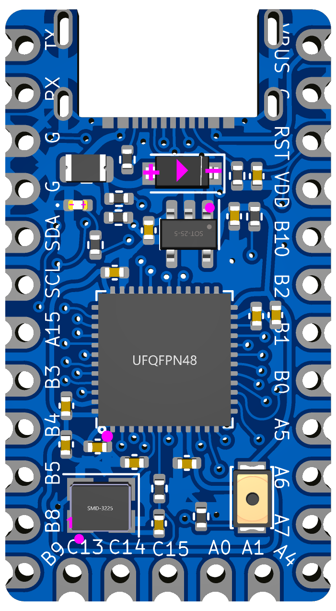

# STeMCell
 STM32 breakout in promicro footprint

## Features:

* Pro micro footprint
* STM32F4x1 series MCU
* Two layer PCB
* Support half duplex USART communication in any of D0, D1, D2, D3 using jumpers
* Onboard switch to enable/disable USB DFU bootloader
* Inbuilt TX pullup for UART half duplex communication
* User LED on PA8
* Extra 5 pinout on bottom like Elite C
* Supports QMK and ZMK
* JLCPCB assembly supported

## v1.0.2
Untested version.

  
&nbsp; &nbsp; &nbsp; &nbsp;
  

